# Observable AI Client - Architecture

## System Architecture

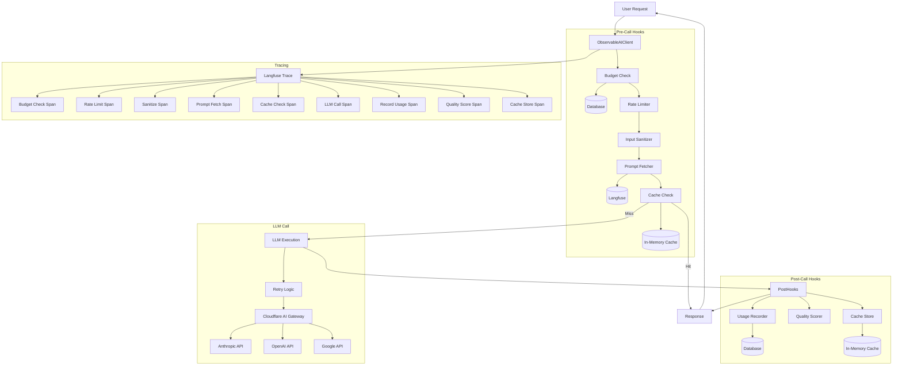

## Request Flow Sequence

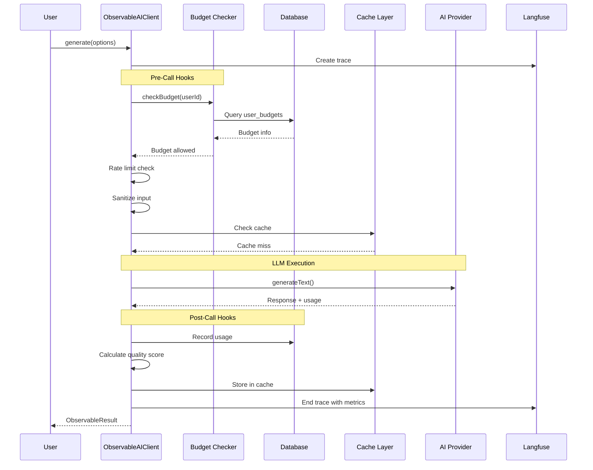

## Trace Structure

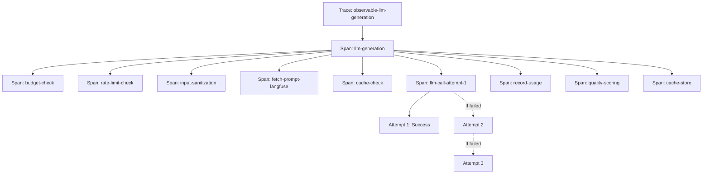

## Cache Key Generation

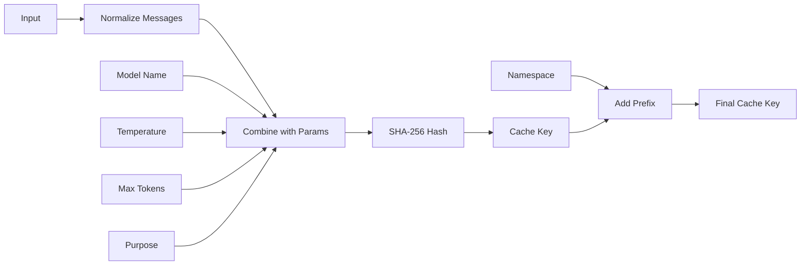

## Rate Limiting (Token Bucket)

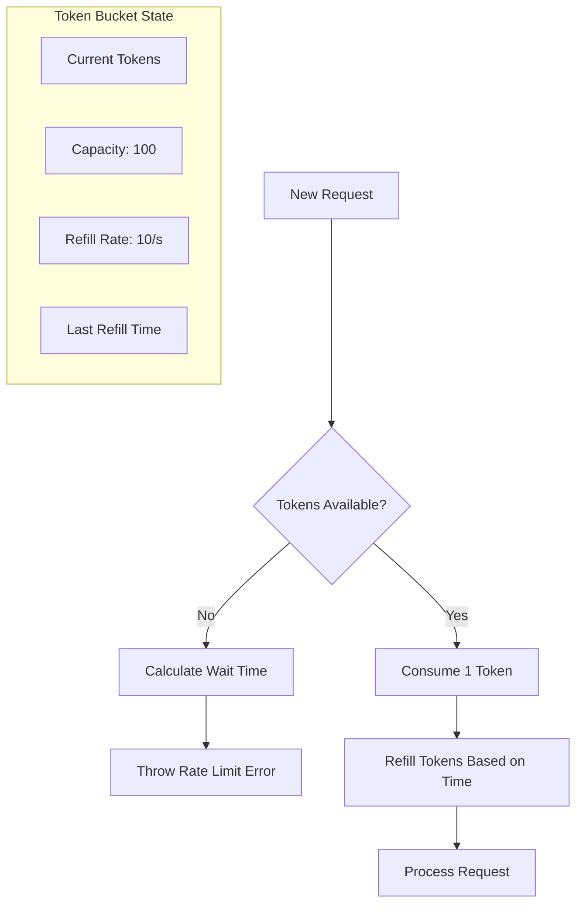

## Cost Calculation Flow

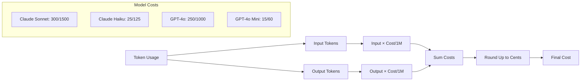

## Data Flow

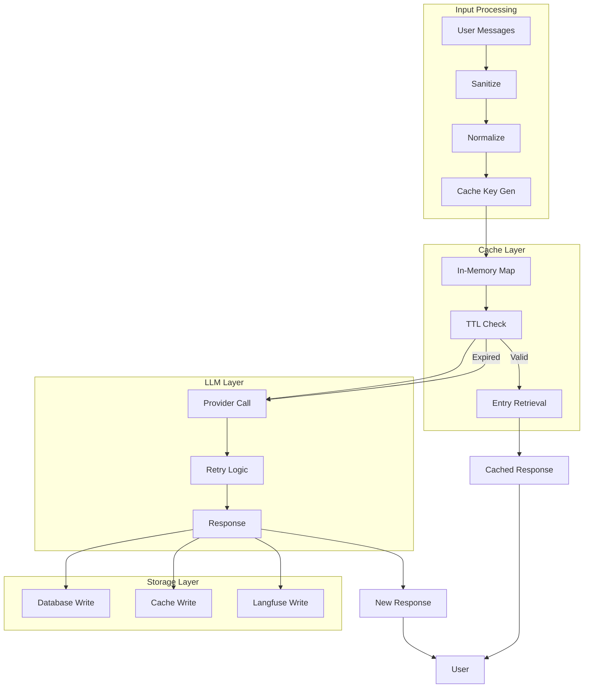

## Component Responsibilities

| Component | Responsibility | Location |
|-----------|----------------|----------|
| **ObservableAIClient** | Main orchestrator, coordinates hooks | `observable-client.ts` |
| **Budget Checker** | Validates user budget before calls | `budget.ts` |
| **Rate Limiter** | Token bucket algorithm, prevents abuse | `observable-client.ts` (in-memory) |
| **Input Sanitizer** | Trims whitespace, limits length | `observable-client.ts` |
| **Prompt Fetcher** | Retrieves versioned prompts from Langfuse | `observable-client.ts` + Langfuse |
| **Cache Layer** | In-memory cache with TTL, SHA-256 keys | `observable-client.ts` (Map) |
| **LLM Executor** | Calls AI SDK with retry logic | `observable-client.ts` + `client.ts` |
| **Usage Recorder** | Stores token usage in database | `budget.ts` |
| **Quality Scorer** | Heuristic-based quality assessment | `observable-client.ts` |
| **Tracer** | Creates hierarchical traces in Langfuse | `observable-client.ts` + Langfuse |

## Performance Metrics

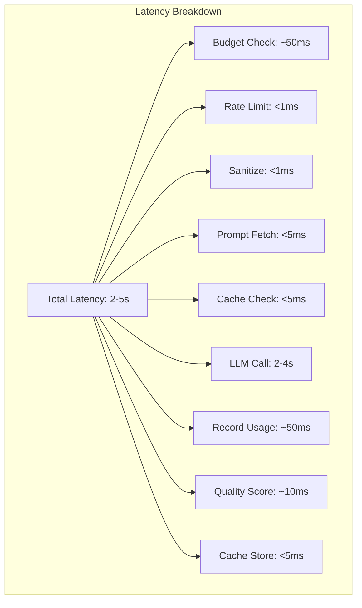

## Error Handling Flow

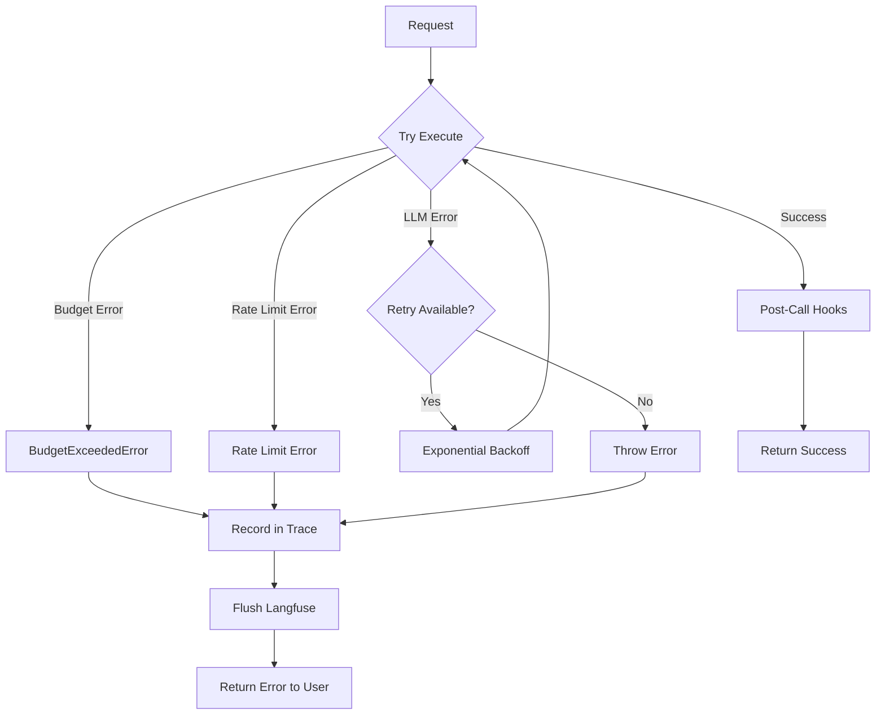

## Cache Management

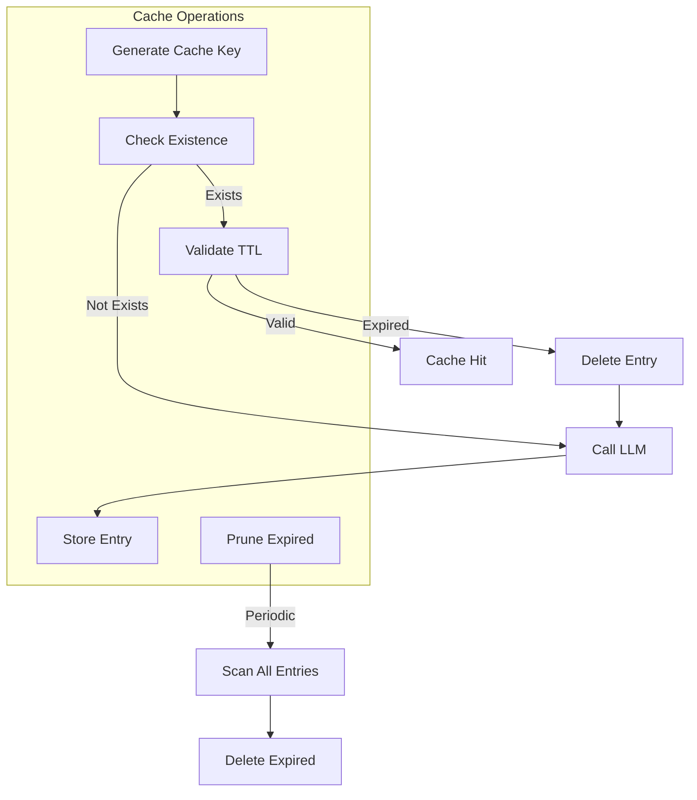

## Quality Scoring Algorithm

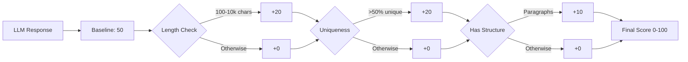

## Integration Points

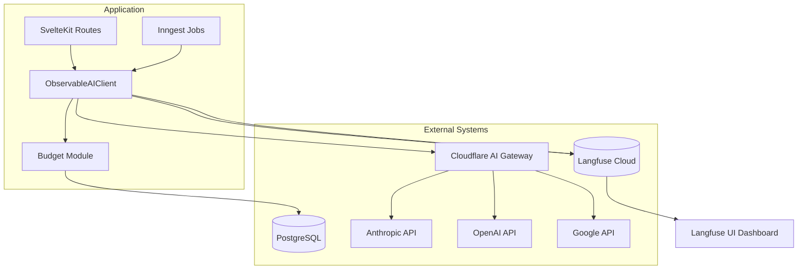

---

## Key Design Decisions

### 1. **In-Memory Cache vs Redis**
- **Decision**: Start with in-memory Map
- **Rationale**: Simpler, zero dependencies, sufficient for single-instance deployments
- **Future**: Migrate to Redis/Valkey for distributed caching

### 2. **Token Bucket vs Sliding Window**
- **Decision**: Token bucket algorithm
- **Rationale**: Allows burst traffic, simpler implementation, fair distribution
- **Configuration**: 100 capacity, 10 tokens/second refill rate

### 3. **Heuristic vs LLM-as-Judge Quality Scoring**
- **Decision**: Start with heuristics
- **Rationale**: Fast (<10ms), no LLM cost, good baseline
- **Future**: Add LLM-as-judge for advanced scoring

### 4. **SHA-256 vs MD5 for Cache Keys**
- **Decision**: SHA-256
- **Rationale**: More secure, collision-resistant, industry standard
- **Trade-off**: Slightly slower (negligible in practice)

### 5. **Exponential Backoff Retry Strategy**
- **Decision**: Exponential backoff (1s, 2s, 4s)
- **Rationale**: Prevents thundering herd, respects rate limits
- **Configuration**: Max 3 retries by default

---

## Performance Targets

| Metric | Target | Current |
|--------|--------|---------|
| Cache Hit Rate | >50% | TBD (depends on usage) |
| Cache Lookup Latency | <5ms | ~2ms (in-memory) |
| Budget Check Latency | <100ms | ~50ms (database query) |
| Rate Limit Check | <1ms | <1ms (in-memory) |
| Quality Scoring | <20ms | ~10ms (heuristics) |
| Total Overhead | <200ms | ~70ms (without LLM call) |
| Cache Size | <1GB | TBD (depends on usage) |

---

## Monitoring Dashboard (Langfuse)

### Key Metrics to Track

1. **Cost Metrics**
   - Total cost per user
   - Cost per model
   - Cost per purpose
   - Cache savings

2. **Performance Metrics**
   - Average latency
   - P95/P99 latency
   - Cache hit rate
   - LLM call rate

3. **Quality Metrics**
   - Average quality score
   - Quality score distribution
   - Quality by model
   - Quality by purpose

4. **Error Metrics**
   - Budget exceeded rate
   - Rate limit errors
   - LLM failures
   - Retry success rate

---

## Security Considerations

1. **Input Sanitization**: Prevent prompt injection attacks
2. **Budget Enforcement**: Hard limits to prevent abuse
3. **Rate Limiting**: Prevent DoS attacks
4. **Cache Key Hashing**: Deterministic but secure (SHA-256)
5. **Trace Data**: Sensitive data may appear in traces (PII concerns)

---

## Scalability Considerations

### Current Limits (In-Memory)
- Cache: Limited by Node.js heap (~1.4GB)
- Rate Limiting: Per-instance (not distributed)
- Trace Flushing: Non-blocking async

### Future Scaling (Redis/Distributed)
- Cache: Shared across instances
- Rate Limiting: Distributed token bucket
- Horizontal Scaling: Multiple instances share state
